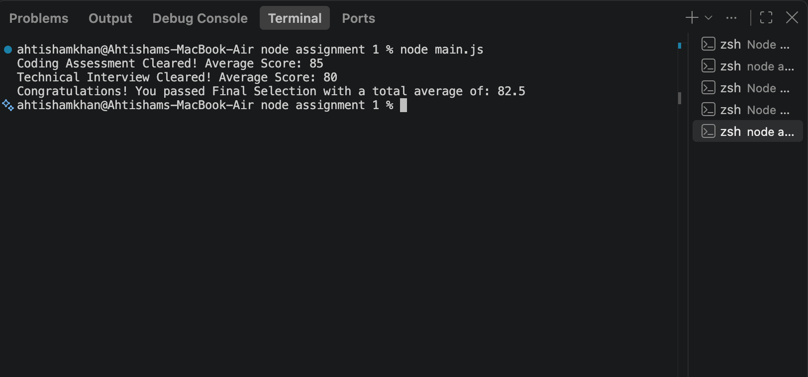
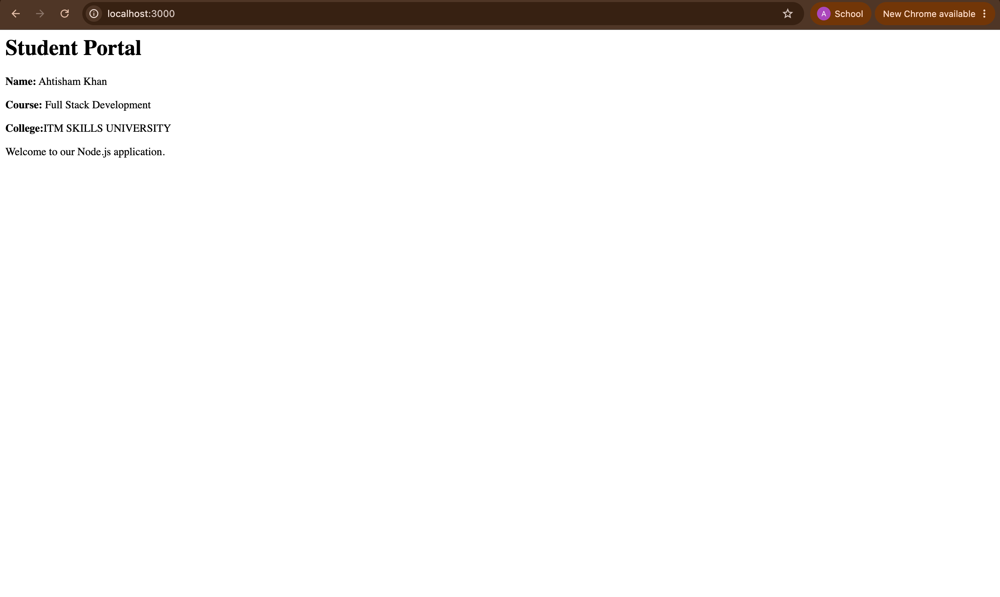
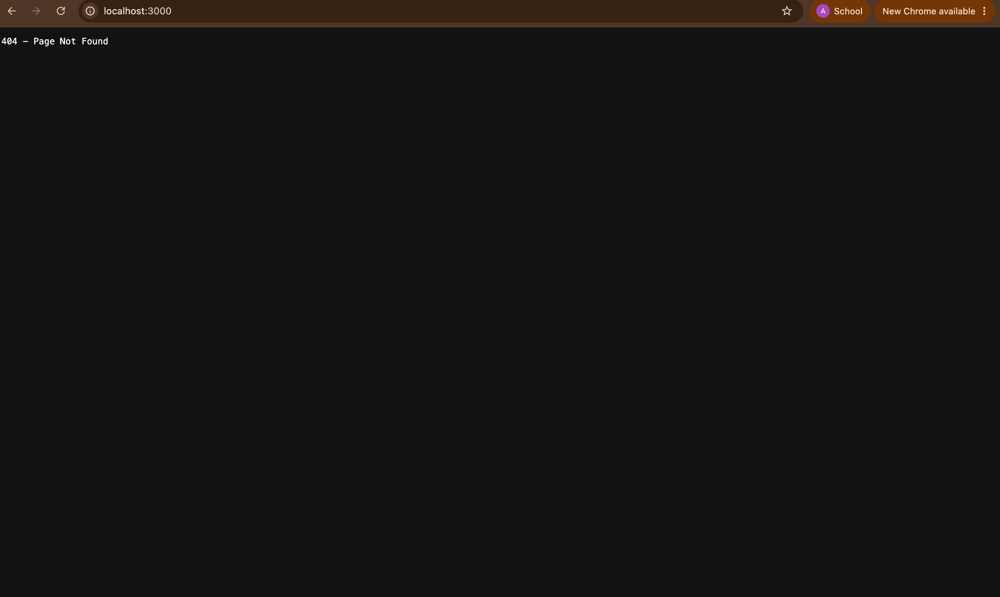
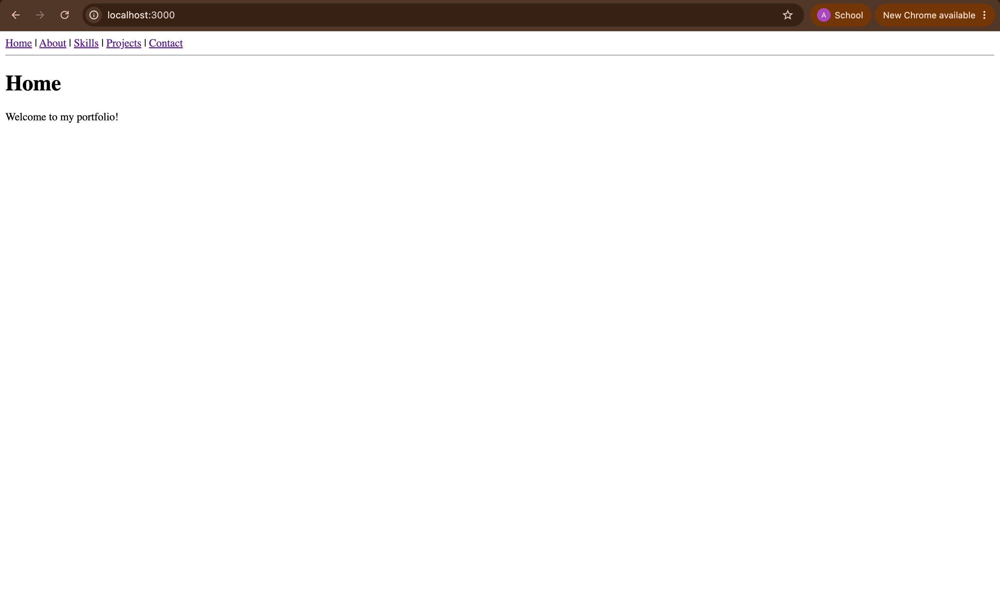

# Node Assignments

This repository contains multiple Node.js practice assignments and coding exercises. It includes task implementations, sample outputs, and visual reference screenshots stored in the `Samples` folder.

## Project Structure

- `node assignment 1/` - basic Node.js assignment with async flow and selection logic
- `Node assignment 2/` - additional assignment files covering various JavaScript/Node.js tasks
- `Samples/` - screenshots and sample outputs for the project

## Sample Screenshots

Below are some sample images from the project:

### Main Sample


### Assignment 2 Sample


### Assignment 3 Sample


### Assignment 4 Sample


### Assignment 5 Sample


## Overview

These assignments focus on:

- JavaScript fundamentals
- Node.js basics
- Asynchronous programming
- Promise-based logic
- Practice problem solving and output validation

## Run the Project

You can run the files using Node.js from the terminal, for example:

```bash
node "node assignment 1/main.js"
```

Or for the second assignment folder:

```bash
cd "Node assignment 2"
node assignment1.js
```

## Notes

The screenshots in the `Samples` folder are included for quick visual reference and project documentation on GitHub.
